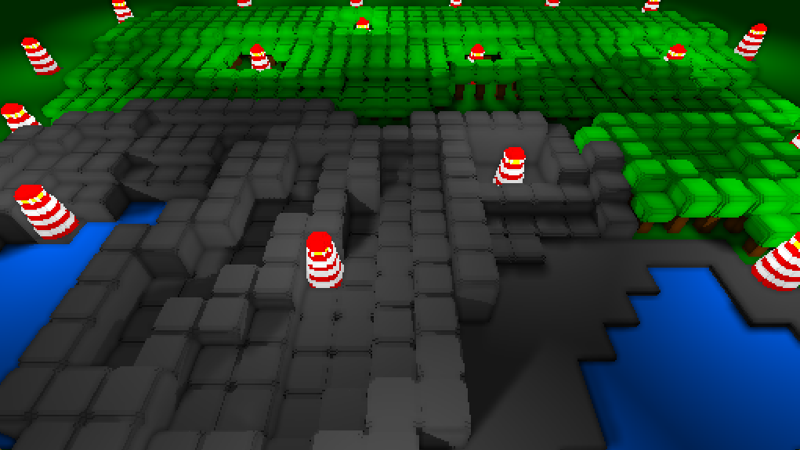

# 2.5D Lighting

2.5D lighting model prototype.
Combines a 2.5D and top-down orthographic view to support a large number of point lights with shadows.
Relies on raycasting instead of rendering from each light source to reduce the number of renders and textures.


*Around 20 point lights running at VSync (74 Hz) on integrated AMD Ryzen 7 4700U Graphics*

Steps:
1. Render the scene from the player view
2. Render the same scene from a topdown orthographic view using back face culling
3. Render the same scene from a topdown orthographic view using front face culling
4. Sample the world space position (ray origin) for each fragment
5. Walk each ray to each light and cull if between the front and back face
6. (optional) Add attenuation, blending, SSAO, etc

See the shader implementation [here](shaders/light.frag)

### Building

#### Windows

Install the [Vulkan SDK](https://www.lunarg.com/vulkan-sdk/) for glslc

```bash
git clone https://github.com/jsoulier/2.5d_lighting --recurse-submodules
cd 2.5d_lighting
mkdir build
cd build
cmake ..
cmake --build . --parallel 8 --config Release
cd bin
./2.5d_lighting.exe
```

#### Linux

```bash
sudo apt install glslc
```

```bash
git clone https://github.com/jsoulier/2.5d_lighting --recurse-submodules
cd 2.5d_lighting
mkdir build
cd build
cmake .. -DCMAKE_BUILD_TYPE=Release
cmake --build . --parallel 8
cd bin
./2.5d_lighting
```

### Bugs

- The screen will be entirely black if there's no lights in the scene